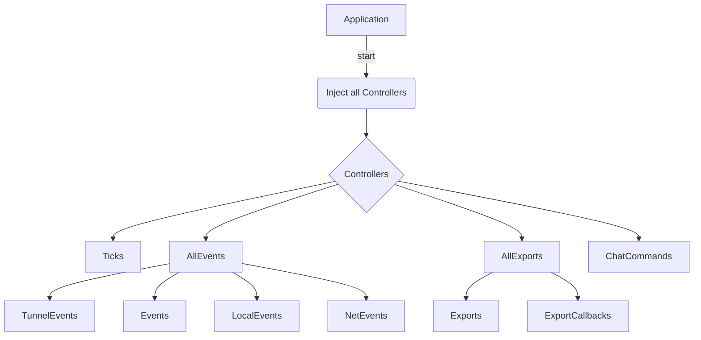

# About

- This framework work written in typescript
- Using [inversifyJS](https://inversify.io/) library which support inversion of control (IoC) container
  for JavaScript & Node.js apps powered by TypeScript.
- UI using ReactJS Framework

## Structure

